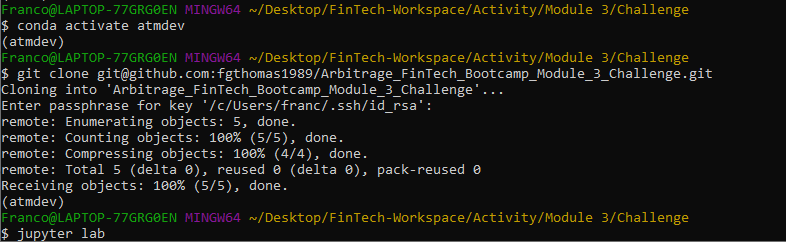
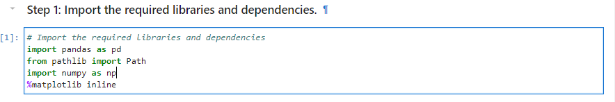

# Portfolio Risk and Return

___
The purpose of this project is to evaluate four new investment options for inclusion in the client portfolios.

I will produce a Jupyter notebook that contains your data preparation, analysis, and visualizations for key risk and return metrics.

Finally, I will recommend the fund with the most investment potential based on key risk-management metrics: the daily returns, standard deviations, Sharpe ratios, and betas.

---

## Technologies

This project leverages python 3.7 with various Libraries and IDE:

* [Jupyterlab](http://justinbois.github.io/bootcamp/2020_fsri/lessons/l01_welcome.html#Jupyter) - An interactive development environment

* [Pandas](https://www.w3schools.com/python/pandas/pandas_dataframes.asp) - A useful python library for analysis.

* [Numpy](https://www.w3schools.com/python/numpy/numpy_intro.asp) - A useful Python library for working with arrays.

* [Matplotlib](https://www.w3schools.com/python/matplotlib_intro.asp) - A useful python library for low level graph plotting that serves as a visualization utility.

---

## Installation Guide

In order to run the application, one must first install the following dependencies.

* First one would open JupyterLab with the following in GitBash.

* One would the following libraries and dependencies as should below:

import pandas as pd

from pathlib import Path

import numpy as np

%matplotlib inline

---

## Usage
To use the analysis, clone the repository and run the risk_return_analysis.ipynb within the Jupyter Notebook.

---

## Contributors

Brought to you by Franco Thomas via the Columbia Engineering FinTech Bootcamp.

Significant contributions made by subcontractors Professor Marghub Mirza, TA Ashfaque, and TA Boomin Kwon.

---

## License

MIT
